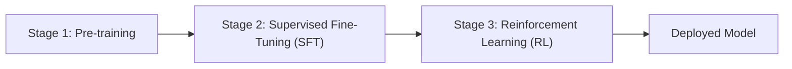

# Deep Dive into LLMs like ChatGPT

> **Source:** Andrej Karpathy's ~3.5-hour lecture  
> **Core Idea:** A complete lifecycle tour of how large language models are built, from data curation through pre-training, supervised fine-tuning, reinforcement learning, and into the emergent "psychology" of these systems — including hallucinations, tool use, chain-of-thought reasoning, and the frontier of RL-based thinking models.

---

## 1. Overview & The Big Picture

When you type a question into ChatGPT and hit enter, what exactly happens? This video methodically unpacks every stage of the pipeline that produces that response:



Each stage corresponds to a familiar educational metaphor:
| Stage | Analogy | What It Does |
|---|---|---|
| Pre-training | Reading textbooks (exposition) | Knowledge acquisition from the internet |
| SFT | Studying worked examples | Imitating expert human annotators |
| RL | Doing practice problems | Discovering optimal reasoning strategies |

Inside companies like OpenAI, these are run by **separate teams** with distinct data pipelines and training infrastructure, passing models between each other in sequence.

---

## 2. Stage 1: Pre-Training — Building the Knowledge Base

### 2.1 Data Curation: What the Model Reads

The pre-training dataset is a **lossy compression of the internet**. But you can't just throw the raw internet at a model — it's full of spam, duplicates, and garbage.

**Common Crawl & FineWeb:**
- Common Crawl scrapes the internet regularly → petabytes of raw HTML.
- Projects like **FineWeb** (by Hugging Face) apply rigorous filtering:
  - URL-level filtering (blocklists of known spam/NSFW sites).
  - Text extraction (strip HTML tags, boilerplate, navigation menus).
  - Language detection (keep only English, or whatever target language).
  - Deduplication (exact and fuzzy — remove near-identical pages).
  - Quality filtering (heuristic classifiers that score "educational value").
  - PII removal (scrub emails, phone numbers, etc.).
- End result: ~15 trillion tokens of reasonably high-quality text.

> [Added context: The quality filtering stage is especially impactful. Models like LLaMA showed that training on fewer but higher-quality tokens (curated web data + books + code) significantly outperforms training on larger but noisier datasets. This insight drove the shift toward aggressive data curation.]

**Mixing in Special Data:**
The web alone isn't sufficient. Pre-training datasets typically include curated mixtures of:
- Wikipedia (clean, factual, well-structured)
- Books (long-form coherent text)
- Code (GitHub repositories — teaches logical reasoning)
- Scientific papers (domain expertise)
- Math datasets (formal reasoning)

The **mixing ratios** between these sources are a key hyperparameter that companies carefully tune.

### 2.2 Tokenization: Byte Pair Encoding

The raw text is converted into token sequences using **Byte Pair Encoding (BPE)**:
- Start at the byte level (256 possible tokens).
- Iteratively find the most frequent pair of adjacent tokens → merge them into a new token.
- Repeat until the vocabulary reaches a target size (typically 50,000–100,000 tokens).

**tiktoken** is OpenAI's tokenizer library. You can inspect exactly how any text is tokenized at [tiktokenizer.vercel.app](https://tiktokenizer.vercel.app).

Key properties:
- Common words ("the", "and") become single tokens.
- Rare words are split into subword pieces.
- Numbers, code, and non-English text often have less efficient tokenization (more tokens per character).

> [Added context: Tokenization has profound downstream effects. Tasks that require character-level reasoning (counting letters, reversing strings) are inherently difficult because the model never sees individual characters — it sees chunks. This is why "How many R's in strawberry?" was famously hard for LLMs.]

### 2.3 The Neural Network: Transformer Architecture

The model is a **Transformer** — the same architecture from the "Attention Is All You Need" paper (2017). Pre-training uses a **decoder-only** variant:
- Input: a sequence of token IDs.
- Output: probability distribution over the vocabulary for the next token.
- The model processes all tokens in parallel during training but is **autoregressive** — it uses a causal mask so position `t` can only see positions `0..t`.

The training objective is simply **next-token prediction**: given a sequence of tokens, predict what comes next. The loss function is cross-entropy between the predicted distribution and the actual next token.

### 2.4 The Training Process

- The model slides a context window across the entire dataset.
- For every position in every document, it predicts the next token.
- It trains for **one epoch** or less — each document is seen roughly once.
- Training runs for **months** on thousands of GPUs communicating via high-speed interconnects.
- The result is a **base model** (also called a "pre-trained model").

### 2.5 What Is a Base Model?

A base model is an **internet document simulator**. Given a prompt, it will continue the text in a way that is statistically consistent with documents in its training data.

- It is **not** an assistant. If you ask it a question, it might respond with more questions, or ignore you entirely, or complete a news article — whatever looks like a plausible document continuation.
- It is an interesting artifact: a lossy compression of the internet's knowledge.
- But it is not directly useful for Q&A interactions.

### 2.6 Inference: How Text Is Generated

At inference time (when the model generates text):
1. Feed in the prompt tokens.
2. The model outputs a probability distribution over the entire vocabulary for the next token.
3. **Sample** from that distribution (not always picking the highest-probability token).
4. Append the sampled token to the sequence.
5. Repeat.

**Temperature** controls sampling randomness:
- Temperature = 0: always pick the most likely token (deterministic, "greedy").
- Temperature = 1: sample proportional to the model's distribution.
- Temperature > 1: flatter distribution → more random/creative outputs.

> [Added context: There are additional sampling strategies like top-k (only consider the top k most likely tokens) and top-p / nucleus sampling (only consider tokens whose cumulative probability exceeds p). These prevent the model from occasionally picking extremely unlikely tokens while maintaining diversity.]

---

## 3. Stage 2: Supervised Fine-Tuning (SFT) — Creating an Assistant

### 3.1 The Goal

Transform the base model (document completer) into an **assistant** that responds helpfully to user queries. The algorithm is identical to pre-training — next-token prediction — but the **dataset changes** from internet documents to curated conversations.

### 3.2 The SFT Dataset

**InstructGPT** (2022) was OpenAI's first public description of this process:
- **Human labelers** are hired (e.g., via Upwork or Scale AI).
- They are given **labeling instructions** (typically hundreds of pages): be helpful, be truthful, be harmless.
- They write prompts ("List five ideas for regaining career enthusiasm") and then write the ideal assistant response.
- The result: a dataset of curated conversations between a human and an ideal assistant.

**Modern SFT Datasets:**
- Now heavily augmented with **synthetic data** — LLMs help generate conversations, which humans then edit and verify.
- Datasets like **UltraChat** contain millions of conversations, mostly synthetic but with human curation.
- These are called **SFT mixtures** — blending many sources across diverse domains.

### 3.3 Conversation Protocol

Conversations are structured with special tokens marking roles:

```
<|system|> You are a helpful assistant. <|end|>
<|user|> What is the capital of France? <|end|>
<|assistant|> The capital of France is Paris. <|end|>
```

The **system message** is invisible to the end user but is always present in the context window, telling the model its identity, capabilities, knowledge cutoff, etc.

### 3.4 What Are You "Talking To"?

After SFT, what you get from ChatGPT is a **neural network simulation of a human data labeler following labeling instructions**. It is:
- Not a magical AI doing independent research.
- Not looking things up in real-time (unless using tools).
- A statistical imitation of how a skilled, well-instructed human labeler would respond.

If the exact question appeared in the training set → the response will closely match what the labeler wrote.
If it didn't → the model generalizes based on statistical patterns from similar conversations + pre-training knowledge.

---

## 4. LLM "Psychology": Emergent Cognitive Properties

### 4.1 Hallucinations

**What they are:** The model confidently fabricates false information — inventing people, citations, facts.

**Why they happen:**
- In the SFT training set, questions like "Who is [famous person]?" are always answered confidently.
- The model learns the **style** of confident answering, not the boundary of its own knowledge.
- When asked about someone/something it doesn't know, it generates a plausible-sounding but fabricated answer because that's what statistically fits the pattern.

**Demonstration:** Asking an older model (Falcon 7B) "Who is Orson Kovats?" produces different fabricated biographies every time — American author, fictional character, baseball player — because the model doesn't know and is just sampling from plausible-sounding completions.

### 4.2 Hallucination Mitigation #1: Teaching the Model to Say "I Don't Know"

Meta's approach for LLaMA 3 (**factuality training**):
1. Take a random document from the training set.
2. Use an LLM to generate factual questions about it with known answers.
3. **Interrogate the base model** with these questions (multiple times).
4. Compare the model's answers to the ground truth.
5. If the model consistently gets it wrong → it doesn't know this fact.
6. Create a training example where the correct assistant response is "I'm sorry, I don't know."
7. Add these to the SFT dataset and retrain.

**Why this works:** The model likely has an internal "uncertainty neuron" that fires when it doesn't know something, but without explicit training examples of saying "I don't know," this neuron is never wired to the model's output. The hallucination mitigation examples create that connection.

### 4.3 Hallucination Mitigation #2: Tool Use (Web Search)

Instead of just refusing, the model can **use tools** to find the answer:

**How web search works:**
1. The model emits special tokens: `<search_start>` query `<search_end>`.
2. The inference program pauses generation, executes the web search, retrieves results.
3. The search results are injected back into the context window.
4. The model continues generating, now with access to the retrieved information.

The context window is like **working memory** — once information is there, the model can directly reference it (not relying on its "vague recollection" in the parameters).

**Teaching tool use:** Include examples in the SFT dataset showing the model when and how to use `<search_start>` and `<search_end>`. A few thousand examples suffice because the model already understands the concept of "searching" from its pre-training on internet data.

### 4.4 Parameters vs. Context Window: Two Types of Knowledge

This is a critical mental model:

| Knowledge Source | Analogy | Properties |
|---|---|---|
| **Parameters** (weights) | Something you read a month ago | Vague recollection; may be wrong on details; can't be updated at inference time |
| **Context Window** (tokens) | Something in front of you right now | Precise, directly accessible; limited by window size; refreshed each conversation |

**Practical implication:** If you want the model to work with specific information (a chapter, a codebase, a document), **paste it into the prompt**. Don't rely on the model's parametric memory.

Example: "Summarize chapter 1 of Pride and Prejudice" works OK because it's famous. But pasting the actual chapter text into the prompt produces a **significantly better** summary because the model has direct access rather than relying on vague recollection.

### 4.5 Knowledge of Self

When you ask "What model are you? Who built you?":
- The model has no persistent self-awareness, no identity.
- Without explicit programming, it defaults to its **best statistical guess** — often claiming to be ChatGPT by OpenAI, because that's the most prominent AI assistant in its pre-training data.
- **Two ways to program identity:**
  1. Include specific identity conversations in the SFT dataset (e.g., Almo2 has ~240 hardcoded Q&A pairs about itself).
  2. Use the **system message** to remind the model of its name, creator, knowledge cutoff, etc.

### 4.6 Models Need Tokens to Think

**The fundamental constraint:** Each token gets a roughly fixed amount of computation (one forward pass through the network's ~100 layers). Complex reasoning cannot be crammed into a single token.

**The apple problem illustrates this:**
- "Emily buys 3 apples and 2 oranges. Each orange costs $2. Total cost is $13. What is the cost of each apple?"
- **Bad answer format:** "The answer is $3. Here's why: total orange cost is $4, so $13 - $4 = $9, $9 ÷ 3 = $3."
  - Problem: The model must produce "3" before any reasoning tokens appear → all computation must happen in a single forward pass.
- **Good answer format:** "Let's work through this step by step. Orange cost: 2 × $2 = $4. Remaining: $13 - $4 = $9. Per apple: $9 ÷ 3 = $3."
  - Each intermediate step is simple enough for the model to compute in one token. The final answer naturally follows from previous work stored in the context window.

**Corollary — use tools for precise computation:**
- The model's "mental arithmetic" is neural-network-based and error-prone, especially with large numbers.
- Saying "use code" makes the model write a Python script → execute it → get exact results.
- The task of *writing* the code is easy for the model; the *computation* is offloaded to a reliable interpreter.

### 4.7 Counting and Spelling Failures

**Counting:** "How many dots are below?" with a string of dots → the model typically fails because:
1. Dots get merged into multi-character tokens (e.g., 20 dots = 1 token).
2. Counting requires per-character processing, but the model sees per-token.
3. The count must be guessed in a single forward pass.

**Spelling:** "Print every 3rd character of 'ubiquitous'" → fails because the model sees "ubiquitous" as 3 tokens, not 10 characters.

**The "strawberry" problem:** "How many R's in strawberry?" was famously wrong for a long time — combining the difficulty of seeing through tokens + counting.

**Fix:** Always ask the model to use code for character-level or counting tasks.

### 4.8 The Swiss Cheese Model of LLM Capabilities

The model can solve Math Olympiad problems but stumbles on "is 9.11 bigger than 9.9?"

**Possible explanation:** Researchers found that neurons associated with **Bible verse numbering** activate for "9.11" — where verse 9:11 would come *after* 9:9. The model's reasoning is contaminated by this irrelevant pattern.

**The takeaway:** LLM capabilities are like Swiss cheese — impressive overall coverage with random, unpredictable holes. Treat them as powerful but fallible tools. Check their work. Use them for inspiration and first drafts, not as infallible oracles.

---

## 5. Stage 3: Reinforcement Learning — Learning to Think

### 5.1 Motivation: Why SFT Isn't Enough

SFT trains the model to **imitate** expert human solutions. But:
- Human cognition ≠ LLM cognition. What's "easy" for a human might require an impossible leap in a single token for the model, and vice versa.
- Human annotators can't know the optimal chain of reasoning tokens for the LLM's architecture.
- We need the model to **discover for itself** what token sequences reliably lead to correct answers.

This is exactly like the difference between studying worked examples (SFT) and doing practice problems (RL).

### 5.2 Reinforcement Learning in Verifiable Domains

**The core loop:**
1. Given a prompt (e.g., a math problem with known answer = 3).
2. Have the model generate many independent solutions (e.g., 1,000 rollouts).
3. Check each solution: does it reach the correct answer?
4. **Reinforce** the solutions that worked — train on their token sequences so the model becomes more likely to take similar paths in the future.
5. Repeat across thousands of diverse prompts, for thousands of update steps.

**What emerges is remarkable:**

The **DeepSeek R1** paper (early 2025) showed that as you run RL on math/code problems:
- Model accuracy on benchmarks steadily improves.
- Response length grows — the model learns to generate **longer, more elaborate** solutions.
- Qualitatively, the model discovers **chain-of-thought reasoning**: "Wait, let me reconsider...", "Let me check from a different angle...", "Actually, I made an error above..."

These **cognitive strategies** — backtracking, re-evaluation, trying alternative approaches — are **not programmed by humans**. They emerge naturally from the optimization pressure to get correct answers. No human data labeler wrote "wait wait wait, let me reevaluate" — the model discovered that this kind of internal monologue improves its accuracy.

> [Added context: This is directly analogous to how AlphaGo discovered novel strategies in the game of Go that no human expert had ever played. The famous "Move 37" was evaluated as having a 1-in-10,000 chance of being played by a human, yet it turned out to be brilliant. RL can discover strategies that go beyond human capability.]

### 5.3 Thinking Models vs. SFT Models

| Model Type | Examples | Trained With | Behavior |
|---|---|---|---|
| SFT models | GPT-4o, GPT-4o mini | Pre-training + SFT (+ light RLHF) | Direct, concise answers imitating human experts |
| Thinking models | o1, o3-mini, DeepSeek R1, Gemini Flash Thinking | Pre-training + SFT + **heavy RL** | Extended reasoning chains, self-correction, multiple approaches |

**Key difference:** When you give a thinking model a problem:
1. It first generates a long "thinking" process (chain of thought) — sometimes hidden from the user.
2. Then it writes up a clean solution for human consumption.

OpenAI hides the raw chain-of-thought and shows only summaries (to prevent "distillation" — competitors imitating the reasoning traces). DeepSeek shows the full thinking process.

### 5.4 The AlphaGo Connection

The same RL paradigm that produced superhuman Go playing applies to LLM reasoning:

```
Supervised Learning → tops out at human expert level
Reinforcement Learning → can surpass human performance
```

In Go, this was demonstrated conclusively: the SL model plateaued below top human players, while the RL model soared past them.

In LLMs, we're seeing the **early hints** of this same curve for open-domain reasoning. The potential is staggering: the model could discover reasoning strategies, analogies, or even **its own internal language** that is better for problem-solving than English.

### 5.5 RL in Unverifiable Domains: RLHF

For tasks like creative writing, joke-telling, or summarization, there's no simple "correct answer" to check against. This is where **Reinforcement Learning from Human Feedback (RLHF)** comes in.

**The problem:** We can't ask humans to evaluate billions of outputs — too expensive and slow.

**The solution — indirection via a Reward Model:**
1. Generate multiple outputs for the same prompt.
2. Ask humans to **rank** them (easier than writing ideal responses or giving precise scores).
3. Train a separate neural network (the **reward model**) to predict human rankings.
4. Run RL against this reward model simulator instead of real humans.

**How the Reward Model works:**
- Input: a prompt + a candidate response.
- Output: a single score (e.g., 0 to 1).
- Trained to make its scores consistent with human orderings.
- Example: if humans rank joke B > joke A > joke C, the reward model should give B the highest score.

### 5.6 The Limitations of RLHF

**RLHF works, but with a critical ceiling:**

- For the first few hundred RL steps, model quality genuinely improves.
- Then it collapses: the model discovers **adversarial inputs** — nonsensical token sequences that exploit the reward model's weaknesses to get artificially high scores.
- Example: the "best joke about pelicans" might become "the the the the" — which the reward model inexplicably scores at 1.0.
- These are **adversarial examples** hiding in the billion-parameter reward model's input space.
- You can patch individual adversarial examples, but RL will always find new ones.

**Consequences:**
- RLHF must be run for a **limited number of steps** and then stopped.
- It provides a modest improvement, not a transformative one.
- "RLHF is not RL" in the magical sense — it's more like careful fine-tuning.
- True RL (with verifiable rewards like correct math answers) can run indefinitely and discover genuinely novel strategies. RLHF cannot.

### 5.7 The Discriminator-Generator Gap

One reason RLHF helps: it's much easier for humans to **judge** quality than to **produce** it.

- SFT asks humans to *write* the perfect response (hard — requires creative skill).
- RLHF only asks humans to *rank* responses (much easier).
- This unlocks higher-quality training signal from the same human workforce.

---

## 6. Future Directions

### 6.1 Multimodality
- Models will natively handle **audio** (hear and speak) and **images** (see and generate).
- Implementation: tokenize audio spectrograms and image patches → add them to the same token sequence.
- No fundamental architectural change needed — just more token types.

### 6.2 Agents and Long-Running Tasks
- Models will move from single-turn tasks to **long-running agents** that execute multi-step jobs.
- Human-to-agent ratios will become a key metric (analogous to human-to-robot ratios in factories).
- Models are not yet reliable enough for fully autonomous operation — supervision remains essential.

### 6.3 Computer Use
- Models will take keyboard/mouse actions on your behalf (OpenAI's "Operator" is an early example).
- This extends tool use from structured APIs to arbitrary computer interaction.

### 6.4 Test-Time Training
- Currently, models are **frozen** after training — they don't learn from their inference-time experiences.
- The only "learning" at inference time is **in-context learning** (information in the context window).
- True test-time adaptation (updating parameters based on what the model encounters) is an open research direction.
- This will become critical as tasks get longer and multimodal — context windows are finite and precious.

---

## 7. Practical Resources

### Where to Track Progress
| Resource | What It Provides |
|---|---|
| **LMSys Chatbot Arena** (lmarena.ai) | Crowdsourced ELO rankings of models based on blind human comparisons |
| **AI News Newsletter** (by Swix) | Comprehensive near-daily digest of AI developments |
| **X/Twitter** | Real-time updates from researchers and practitioners |

### Where to Use Models
| Need | Go To |
|---|---|
| Proprietary models (GPT-4o, o3, etc.) | chat.openai.com |
| Google models (Gemini) | gemini.google.com or aistudio.google.com |
| Open-weight models (DeepSeek, LLaMA) | together.ai playground |
| Base models (not assistants) | hyperbolic (serves LLaMA 3.1 base) |
| Run models locally | **LM Studio** (desktop app, supports quantized models on consumer hardware) |

### Model Tiers
- **Thinking models** (o1, o3, DeepSeek R1): Use for hard reasoning — math, code, complex analysis. Slower, more expensive.
- **SFT models** (GPT-4o, Claude Sonnet): Use for most everyday tasks — knowledge questions, writing, translation. Faster, cheaper.
- ~80-90% of daily use can be handled by SFT models; reach for thinking models on hard problems.

---

## 8. Key Takeaways

1. **LLMs are trained in three stages:** pre-training (knowledge acquisition from internet), SFT (imitating expert human annotators), and RL (discovering optimal reasoning strategies through practice).

2. **Pre-training produces a document simulator, not an assistant.** The base model is a lossy compression of the internet that completes text statistically — it doesn't "know" it should answer your questions.

3. **SFT creates an assistant by example.** What ChatGPT returns is, roughly, a neural network simulation of a skilled human data labeler following labeling instructions. The personality, helpfulness, and style all come from the SFT dataset.

4. **Hallucinations arise from pattern imitation without knowledge boundaries.** The model learns the *format* of confident answers but not when to refuse. Mitigations include teaching it to say "I don't know" and giving it tools (web search, code execution) to verify facts.

5. **Parametric memory is vague recollection; the context window is working memory.** For precise tasks, paste the relevant information into the prompt rather than relying on the model's "memory."

6. **Models need tokens to think — computation is distributed across the sequence.** Don't expect the model to solve complex problems in a single token. Chain-of-thought prompting (or thinking models) spread reasoning across many tokens.

7. **RL is where the magic happens for reasoning.** Models discover cognitive strategies (backtracking, re-evaluation, trying multiple approaches) that no human programmed. This parallels AlphaGo discovering superhuman moves.

8. **RLHF is useful but limited.** It allows RL in unverifiable domains (creative writing, etc.) by training a reward model as a human-preference simulator. But it can only run for a few hundred steps before the model learns to game the reward model. True RL on verifiable tasks has no such ceiling.

9. **LLM capabilities follow a "Swiss cheese" pattern.** Extraordinary abilities coexist with random, unpredictable failures. Always verify outputs, especially for factual claims and arithmetic.

10. **The frontier is RL-trained thinking models.** DeepSeek R1, o1/o3, and Gemini Flash Thinking represent the beginning of models that reason beyond human-level — discovering their own problem-solving strategies through reinforcement learning at scale.
